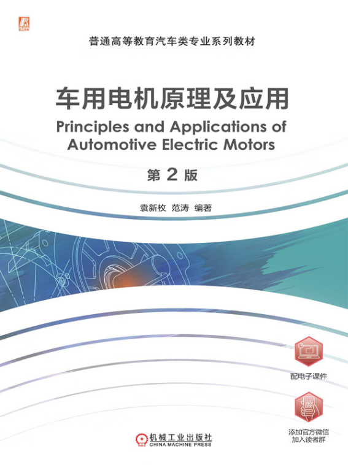

# PMSM_FOC
This repository contains a simulation model demonstrating **vector control of a permanent magnet synchronous motor (PMSM)**, based on **Chapter 12** of the textbook:



> 袁新枚, 范涛. *车用电机原理及应用* [M]. 第2版. 机械工业出版社, 2024.  
> Yuan Xinmei, Fan Tao. *Principles and Applications of Automotive Electric Machines* (2nd Edition), China Machine Press, 2024.

The model is implemented in **MATLAB/Simulink**, and is intended for **educational and research purposes**, especially for those studying automotive electric drive systems.

---

## 📂 Repository Contents

- **`PMSM_FOC_demo.slx`**  
  The main **Simulink model**, which implements Field-Oriented Control (FOC) of a PMSM, including:
  - Clarke and Park transformations  
  - PI controllers for the d-q axes  
  - SVPWM modulation  
  - Speed control loop 
  - PMSM dynamics and inverter model  

- **`para_init.m`**  
  MATLAB script for **initializing model parameters**, such as:
  - Motor parameters (e.g., stator resistance, inductances, pole pairs, flux linkage)  
  - Controller gains  
  - Simulation time settings  

---

## 🚀 Getting Started

### Requirements

- MATLAB **R2010a** or newer
- Simulink  

### How to Run

1. Clone or download this repository.
2. Open MATLAB and navigate to the project folder.
3. Open the Simulink model:
   ```matlab
   open('PMSM_FOC_demo.slx')
   ```
4. Click **Run** to start the simulation.

---

## 📘 Reference

This model corresponds to the practical example in:

> 袁新枚, 范涛. *车用电机原理及应用* [M]. 第2版. 机械工业出版社, 2024.  
> Yuan Xinmei, Fan Tao. *Principles and Applications of Automotive Electric Machines* (2nd Edition), China Machine Press, 2024.

For theoretical background and control principle derivations, please refer to **Chapter 12** of the textbook.

---

## 📌 Notes

- This is a simplified educational model. In real-world applications, additional components such as speed estimation (sensorless), and advanced fault handling should be considered.
- Feel free to modify and extend the model for your learning or research purposes.

---

## 📧 Contact

For questions or feedback, please open an issue or contact the repository owner directly.
